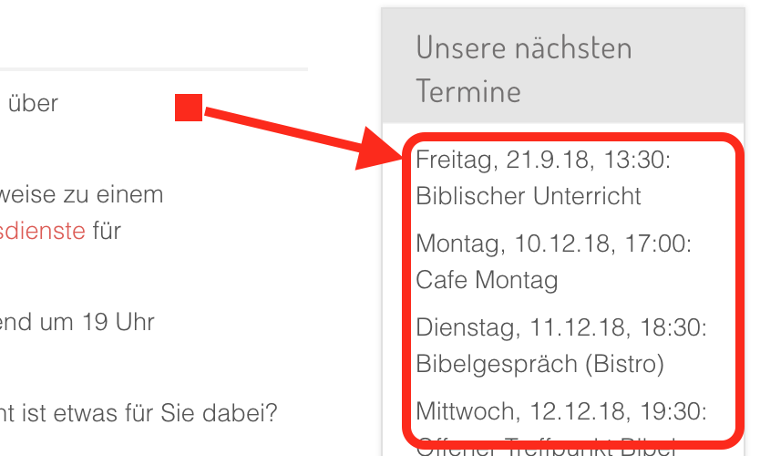

# Projektübersicht

## EasyFPE

{ align=left }

EasyFPE ist eine App für Typ 1-Diabetiker zum einfachen Berechnen von Kohlenhydraten und Fett-Protein-Einheiten (FPE) bzw. verzögerten Kohlenhydraten (auch bekannt als e-Carbs oder Fake Carbs).

Sie ist verfügbar für [Android](https://www.rueth.info/Android-EasyFPU/de) und [Apple iOS](https://www.rueth.info/iOS-EasyFPU/de).

### Feature-Übersicht

| Feature                                           | :material-android:{ .icon-large } | :material-apple:{ .icon-large }   |
| ------------------------------------------------- | --------------------------------- | --------------------------------- |  
| Durchsuch- und filterbare Essensliste             | :material-check:{ .green }        | :material-check:{ .green }        |
| Produktsuche in OpenFoodFacts                     | :material-close:{ .red }          | :material-check:{ .green }        |
| Scannen von Produkt-Barcodes                      | :material-close:{ .red }          | :material-check:{ .green }        |
| Mahlzeit aus beliebig vielen Essensbestandteilen  | :material-check:{ .green }        | :material-check:{ .green }        |
| Berechnung von Kalorien                           | :material-check:{ .green }        | :material-check:{ .green }        |
| Berechnung von regulären Kohlenhydraten           | :material-check:{ .green }        | :material-check:{ .green }        |
| Berechnung von verlängerten Kohlenhydraten        | :material-check:{ .green }        | :material-check:{ .green }        |
| Konfiguration der Absorptionsschemata             | :material-check:{ .green }        | :material-check:{ .green }        |
| Berechnung von Kohlenhydraten aus Zucker          | :material-close:{ .red }          | :material-check:{ .green }        |
| Export nach Apple Health                          | :material-close:{ .red }          | :material-check:{ .green }        |

### Besonderheiten

=== "Essensliste"

    Mit EasyFPE haben Sie Ihre komplexen Mahlzeiten wie Pizza oder das Happy Meal nach dem Schwimmbadbesuch voll im Griff.

    - Beliebig viele Essen anlegen, nach Lieblingsessen filtern oder in der Essensliste suchen
    - Export und Import der Essensliste zur Datensicherung oder zum Teilen
    - Schnelle Übersicht über die verschiedenen Kohlenhydratarten mit Darstellung der passenden Absorptionszeit

=== "Mahlzeit zusammenstellen"

    Wählen Sie beliebig viele Essensbestandteile aus und stellen Sie so Ihre komplexe Mahlzeit zusammen:

    - Beliebig viele Essen auswählen
    - Eigene Menge eingeben oder aus vorkonfigurierte Mengen auswählen
    - Eigene Menge als neue vorkonfigurierte Menge speichern

=== "Mahlzeit berechnen"

    Sehen Sie auf Anhieb, welche Kohlenhydrate wann und wie lange wirken:

    - Schnelle Kohlenhydrate aus Zucker (nur iOS) und reguläre Kohlenhydrate
    - Langsame Kohlenhydrate aus Fett-Protein-Einheiten
    - Wieviel Kohlenhydrate wirken, wann und wie lange wirken diese?

=== "Export nach Apple Health"

    Exportieren Sie Kohlenhydrate und/oder Kalorien nach Apple Health - auch für die weitere Verarbeitung in Apps wie Loop:

    - Konfigurierbare Verzögerung der Mahlzeit (Spritz-Ess-Abstand)
    - Freie Auswahl der zu exportierenden Daten
    - Vorschau der exportierten Daten als grafische Darstellung

=== "Absorptionsschema bearbeiten"

    Bearbeiten Sie Ihre Absorptionsschemata und passen Sie diese auf Ihre persönlichen Umstände an:

    - Schnelle, reguläre und langsame Kohlenhydrate aus Fett-Protein-Einheiten
    - Beginn der Wirkung der jeweiligen Kohlenhydratart und Wirkdauer der jeweiligen Kohlenhydrate
    - Intervallzeit (für den Export nach Apple Health)

## Joomla!-Erweiterungen

{ align=left }

Praktische Erweiterungen für das führende Open Source Content Management System [Joomla!](https://www.joomla.org){:target="_blank"}

Machen Sie sich Ihr Leben einfacher - halten Sie Ihre Webseite aktuell ohne großen Mehraufwand!

### EventList

{ style="width:300px", align=right }

[EventList](https://www.rueth.info/joomla4-eventlist/de) ist ein Joomla!-Paket, das wöchentlich wiederkehrende Veranstaltungen automatisch als übersichtliche Liste darstellt und auf die Detail-Beschreibung verlinkt.

EventList Plugin-Features:

- Auswahl, ob ein Artikel in der Event-Liste dargestellt wird oder nicht
- Felder für Kontaktperson, E-Mail-Adresse, Telefonnummer, Zielgruppe und Ort (relevant für die Anzeige im Artikel)
- Weitere Felder für Wochentag, Startzeit, Endzeit, Kommentar (zusätzlich relevant für die Anzeige im Modul EventList)
- Verschiedene voreingestellte Zeitformate: 24h-Format mit oder ohne führender Null, 12h-Format mit oder ohne führender Null
- Alternativ: Frei konfiguierbares Zeitformat
- Regex-basierte Prüfung des Eingabeformats von Start- und Endzeit
- Ausgabe als Infobox am Ende des Artikels (siehe Bild), konfigurierbar mit oder ohne Kopfzeile / Titel

EventList Modul-Features:

- Anzeige aller ausgewählten Artikel als übersichtliche, kompakte Event-Liste
- Möglichkeit, nicht publizierte Artikel in die Event-Liste aufzunehmen (wenn z.B. kein Artikelinhalt zur Verfügung steht, das Event aber dennoch in der Liste angezeigt werden soll)
- Verschiedene voreingestellte Listendarstellungen: Deutsch (fügt das Wörtchen "Uhr" hinzu) oder international
- Alternativ: Frei konfigurierbares Listenformat
- Verlinkung auf die Detailbeschreibung (nur im Falle von bereits publizierten Artikeln)
- Formatierung via eigenem CSS

### ChurchCal

{ style="width:300px", align=right }

[ChurchCal](https://www.rueth.info/joomla-churchcal/de) ist ein Joomla!-Modul, das Kalendereinträge aus ChurchTools holt und als Events darstellt.

Joomla! ChurchCal

- holt mittels ChurchTools API Kalendereinträge eines oder mehrerer ChurchTools-Kalender
- und stellt diese in auf- oder absteigender Reihenfolge als Liste auf einer Webseite dar, wobei
- optional der Wochentag (Montag, Dienstag, etc.),
- das Datum und die Startzeit, frei formatierbar entsprechend der PHP `date` Funktion,
- optional die Endzeit
- und die Beschreibung des Kalendereintrags

angezeigt werden.
