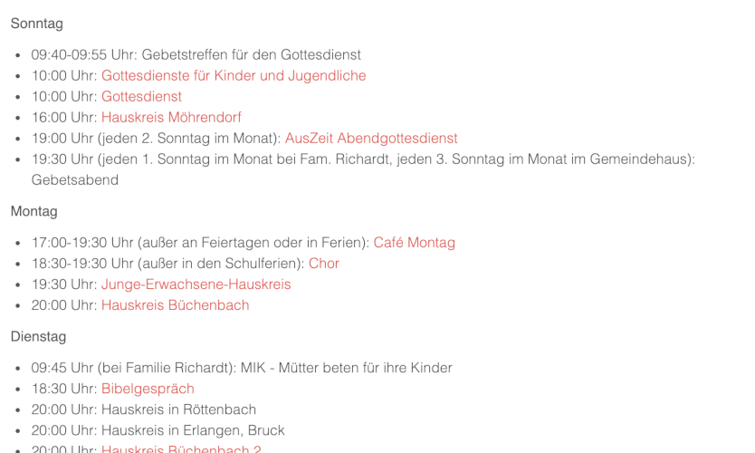

# Project Overview

## EasyFPU

{ align=left }

EasyFPU is an App made for T1D patients to ease the calculation of complex meals with sugars, regular carbs and extended carbs.

It is available for [Android](https://www.rueth.info/Android-EasyFPU) and [Apple iOS](https://www.rueth.info/iOS-EasyFPU).

### Feature Overview

| Feature                                              | :material-android:{ .icon-large } | :material-apple:{ .icon-large }   |
| ---------------------------------------------------- | --------------------------------- | --------------------------------- |  
| Searchable and filterable food list                  | :material-check:{ .green }        | :material-check:{ .green }        |
| Search in OpenFoodFacts food database                | :material-close:{ .red }          | :material-check:{ .green }        |
| Scan product barcodes                                | :material-close:{ .red }          | :material-check:{ .green }        |
| Create own recipes                                   | :material-close:{ .red }          | :material-check:{ .green }        |
| Compose a meal from as many food items as you like   | :material-check:{ .green }        | :material-check:{ .green }        |
| Calculation of calories                              | :material-check:{ .green }        | :material-check:{ .green }        |
| Calculation of regular carbs                         | :material-check:{ .green }        | :material-check:{ .green }        |
| Calculation of extended carbs from fat-protein-units | :material-check:{ .green }        | :material-check:{ .green }        |
| Configuration of the absorption schemes              | :material-check:{ .green }        | :material-check:{ .green }        |
| Calculation of carbs from sugars                     | :material-close:{ .red }          | :material-check:{ .green }        |
| Export to Apple Health                               | :material-close:{ .red }          | :material-check:{ .green }        |

### Features

=== "Food List"

    With EasyFPU you'll master complex meals like pizza or the Happy Meal after swimming:

    - Add as many food items as you wish, and filter or search your food list
    - Export or import your food list for data backup or sharing
    - Fast overview over all carbs types with calculation of the matching absorption time

=== "Create Own Recipes"

    Cook and bake with EasyFPU:

    - Simply add ingredients to your recipe
    - Enter the total weight and number of portions for the final product
    - Save it just like any other dish in your food list

=== "Compose a Meal"

    Choose as many food items as you wish to compose a meal:

    - As many food items as you wish
    - Enter the amount consumed or choose from a pre-configured list of typical amounts
    - Save your amount as new typical amount

=== "Calculate a Meal"

    See at one glance, which carbs will hit your BG when and for how long:

    - Fast carbs from sugars (iOS only) and regular carbs
    - Slow carbs from fat-protein-units
    - How much carbs hit when and for how long?

=== "Export to Apple Health"

    Export carbs and calories to Apple Health - for further utilization by apps like Loop:

    - Configurable delay of your meal
    - Free choice of data to be exported
    - Graphical preview of data to be exported

=== "Edit Absorption Scheme"

    Adapt the Absorption Scheme to your personal needs:

    - Fast, regular and slow carbs from fat-protein-units
    - Delay until the carbs hit your BG and set the time interval how long they will hit your BG
    - Interval between carbs fractions (for Apple Health export only)

## Joomla! Extensions

{ align=left }

Useful extensions for the leading Open Source content management system - [Joomla!](https://www.joomla.org){:target="_blank"}

Make your life easy by keeping your website up-to-date without much effort!

### EventList

{ style="width:300px", align=right }

[EventList](https://www.rueth.info/joomla4-eventlist) is a Joomla! package generating and displaying a clear list of weekly recurring events and linking to their detailed description.

EventList Plugin features:

- Select whether or not an article is included in the Event List
- Additional fields for contact person, e-mail address, phone number, target audience and location (only relevant for display underneath the article)
- Further fields for weekday, starting time, end time and comment (additionally relevant for displaying the article in the Event List)
- Different pre-defined time formats: 24h format with or without leading zeros, 12h format with or without leading zeros
- Alternatively free time format
- Regex based input check of starting and end time
- Frontend display as info box underneath the article (see picture), either with or without header / title

EventList Module features:

- Display of all selected articles as clear, compact event list
- Possibility to include non-published articles in the Event List (e.g. if no article content available, but the event should still be displayed in the Event List)
- Different pre-defined list styles: German (adds the word „Uhr“ at the end of the entry) or international
- Alternatively free list format
- Link to the detailed article (in case the article is published already)
- Fomatting via own CCS

### ChurchCal

{ style="width:300px", align=right }

[ChurchCal](https://www.rueth.info/joomla-churchcal) is a Joomla! module to retrieve and display ChurchTools calendar events as event view on a website.

Joomla! ChurchCal

- retrieves calendar entries from one or more ChurchTools calendars, using the ChurchTools API,
- and displays them either in ascending or descending order as a list on a webpage, showing
- the weekday (Monday, Tuesday, etc.) - optionally -,
- the date and the start time, formatted according to the PHP date function,
- the end time - optionally -,
- and the description of the calendar entry.
